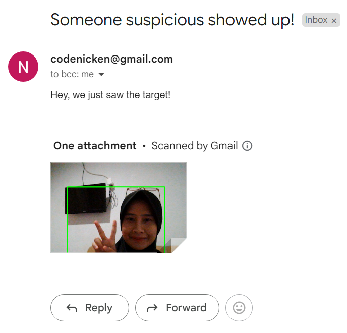

# Build a Webcam Monitoring Email Alert App Using Python

## Project Description

**Overview :**  
The Webcam Monitoring Email Alert App is a Python-based application designed for real-time monitoring of a webcam feed. This application incorporates computer vision techniques to detect suspicious persons and sends email notifications when such activity is identified.

**Challenges :**  
 Build a Webcam Monitoring Email Alert App Using Python.

## Project Goal

The project aims to detect suspicious persons and sends email notifications when the target identified.

## Tools & Library Used

 &nbsp;

## Project Result

[Click here to get full code](https://github.com/nickenshidqia/Build_a_Webcam_Monitoring_Email_Alert_App_Using_Python/blob/2cfedfa6893c481b14dc8b63adbf4e77f657c4b8/main.py)

### Webcam Integration:

- Interface with the computer's webcam to capture live video frames.
- Use techniques such as object detection or motion tracking to identify potential threats.  
  

### Email Notification System:

- Integrate an email notification system to alert users when suspicious activity is detected.  
  
